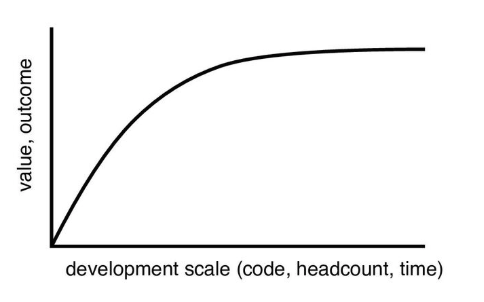
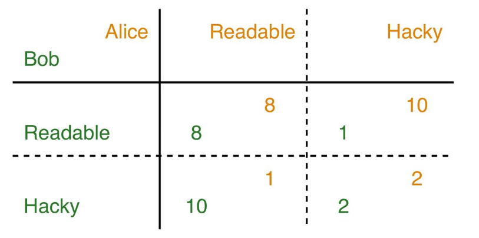
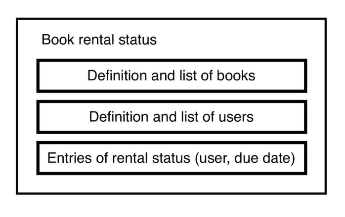
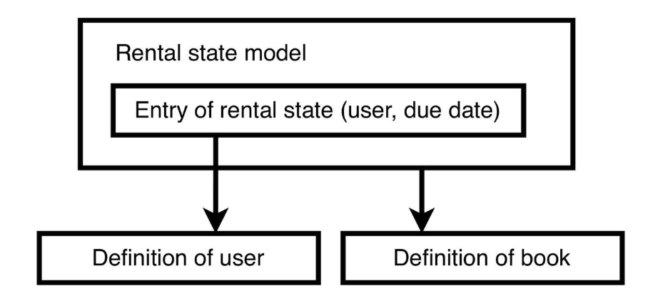

# 程式碼可讀性 Code Readability

原作者 Munetoshi Ishikawa | 繁中版翻譯 Ricky Hu

---
layout: cover
background: https://images.unsplash.com/photo-1502462041640-b3d7e50d0662?q=80&w=1471&auto=format&fit=crop&ixlib=rb-4.1.0&ixid=M3wxMjA3fDB8MHxwaG90by1wYWdlfHx8fGVufDB8fHx8fA%3D%3D
---

程式碼可讀性：第一篇

# 簡介與原則

## Introduction and Principles

---

# 什麼是具備可讀性的程式碼

- **顯而易見 (Obvious)**：使用 `isVisible` 而不是 `flag`
- **簡單 (Simple)**：使用 `isA && isB` 而不是 `!(!isA || !isB) && isB`
- **獨立/隔離 (Isolated)**：函式、類別、模組等應各自獨立
- **結構化 (Structured)**：格式、依賴關係、狀態轉換等

<v-click>

<strong class="highlight">必須同時考量多個特徵</strong>

<strong class="highlight">可讀性取決於「時間」與「上下文情境」</strong>
</v-click>

<div class="slide-tag">（簡介與原則 > 簡介）</div>

---
layout: center
class: text-center
---

## 為什麼我們需要高可讀性的程式碼

<br />

<h1 class="highlight">為了在大型產品中依然能保持「高生產力」</h1>

<div class="slide-tag">（簡介與原則 > 簡介）</div>

---

# 產品規模與生產力

- 大型開發 → 難以維持高生產力
- 價值、產出 < 開發規模（程式碼量、人數、時間）



- 可讀性：**實現高生產力的方法之一**

---

# 產品規模與可讀性

.

在大型產品中，**讀程式碼的時間 > 寫程式碼的時間**

- 為了實作新功能，必須先理解現有的程式碼

- 請求兩位以上的工程師進行程式碼審查 (Code review)

- 即使只修改一行程式碼，也可能涉及複雜的 Bug 修復

<strong class="highlight">「容易閱讀」比「容易撰寫」更重要</strong>

<div class="slide-tag">（簡介與原則 > 簡介）</div>

---

# 生產力最佳化

.

<strong class="highlight">專注於整個產品生命週期中的「團隊生產力」</strong>

- **你多花 5 分鐘，可能為其他人省下 1 小時**
  - 加上註解、撰寫測試、進行重構

- **我們可能需要更新人員的考績評估標準**
  - 不要只專注於短期的實作速度

<div class="slide-tag">（簡介與原則 > 簡介）</div>

---

# 囚徒困境 (Prisoner's dilemma)

如果我們只專注於個人生產力，團隊的生產力可能會下降



<div class="slide-tag">（簡介與原則 > 簡介）</div>

---

# 如何致力於提升可讀性

- **選擇技術與知識**：記住目標

- **在價值與複雜度之間取得平衡**

- **利用自動化驗證的優勢**：編譯器、測試等

- **頻繁討論**：減少錯誤造成的重工

- <strong class="highlight">持續學習</strong>

<div class="slide-tag">（簡介與原則 > 簡介）</div>

---

# 學習如何寫出易讀的程式碼

- **實作功能相對容易**
  - 不需要特別的訓練

- **不學習，就寫不出具可讀性的程式碼**
  - 講座、培訓、書籍、線上文章
  - 同儕程式碼審查 (Peer code review)、結對編程 (Pair programming)

<div class="slide-tag">（簡介與原則 > 簡介）</div>

---

# 本課程內容

- <strong class="highlight">簡介與原則</strong>
- **自然語言**：命名、註解
- **內部類型結構**：狀態、函式
- **類型間結構**：依賴關係 I、依賴關係 II
- **後續**：程式碼審查

<div class="slide-tag">（簡介與原則 > 簡介）</div>

---

# 主題

- 簡介
- 童子軍原則 (The boy scout rule)
- YAGNI 原則 (You Aren't Gonna Need It)
- KISS 原則 (Keep It Simple Stupid)
- 單一職責原則 (Single responsibility principle)
- 過早最佳化是萬惡之源 (Premature optimization is the root of all evil)

<div class="slide-tag">（簡介與原則 > 原則）</div>

---

# 童子軍原則 (The boy scout rule)

> 試著讓這個世界在你離開時，比你發現它時更好一點...
> — Robert Baden-Powell

由 Robert C. Martin 引入軟體開發領域

<h3 class="highlight">只要動到程式碼，就順手改善它</h3>

<div class="slide-tag">（簡介與原則 > 原則 > 童子軍原則）</div>

---

# 實踐童子軍原則的「應做事項 (Dos)」

- **新增 (Add)**：註解、測試
- **移除 (Remove)**：不必要的依賴關係、成員、條件式
- **重新命名 (Rename)**：類別、函式、變數
- **拆分 (Break)**：龐大的類別、龐大的函式、深層巢狀結構、呼叫順序
- **結構化 (Structure)**：格式排版 、依賴關係、抽象層、層級架構

<div class="slide-tag">（簡介與原則 > 原則 > 童子軍原則）</div>

---

# 實踐童子軍原則的「不應做事項 (Don'ts)」

.

<h3 class="highlight">不要在一個龐大的結構中加入新元素</h3>

**範例：**

- 不要在一個龐大的類別/函式中加入**新的成員/敘述**
- 不要在深層的呼叫/類型層級中加入**新的抽象層**

<div class="slide-tag">（簡介與原則 > 原則 > 童子軍原則）</div>

---

# 應做與不應做範例 1/3

.

**問題**：新增一個新的列舉 (enum) 類型 Z 可以嗎？

```kotlin
val viewType: ViewType = ... // 一個列舉類型
when (viewType) {
  A -> {
    view1.isVisible = true
    view2.text = "Case A"
  }
  B -> {
    view1.isVisible = false
    view2.text = "Case B"
  }
  ...
}
```

<div class="slide-tag">（簡介與原則 > 原則 > 童子軍原則）</div>

---

# 應做與不應做範例 2/3

.

**答案：不應該直接加上去**

因為已經有太多的條件分支了。

**解決方案**：將值提取為 enum 的屬性。

<div class="slide-tag">（簡介與原則 > 原則 > 童子軍原則）</div>

---

# 應做與不應做範例 3/3

1. **將值提取為屬性**

```kotlin
enum class ViewType(val isView1Visible: Boolean, val view2Text: String)
```

2. 利用這些屬性**移除條件分支**

```kotlin
view1.isVisible = viewType.isView1Visible
view2.text = viewType.view2Text
```

3. 最後才加入新的類型 Z

<div class="slide-tag">（簡介與原則 > 原則 > 童子軍原則）</div>

---

# 童子軍原則：注意事項

.

- **不要發起過大的 Pull Request 或 Commit**
  - 在實作新功能「之前」先進行重構

- **考量影響範圍**
  - 提前決定重構的範圍
  - 不要在發布分支 (release branch) 上進行重構

<div class="slide-tag">（簡介與原則 > 原則 > 童子軍原則）</div>

---

# YAGNI 原則

.

**You Aren't Gonna Need It (你不需要它)**

只在需要的時候才實作

- 為了未來預留的 **90%** 功能最後都**不會被用到**
- **保持結構簡單** ＝ 為未知的變化做好準備

<div class="slide-tag">（簡介與原則 > 原則 > YAGNI）</div>

---

# YAGNI 範例 1/2

- **未使用的程式碼**
  - 未被參照的類別/函式/變數
  - 被註解掉的程式碼

- **過度擴充的程式碼**
  - 只有一個實作的抽象類型
  - 僅用於傳遞常數值的函式參數

<div class="slide-tag">（簡介與原則 > 原則 > YAGNI）</div>

---

# YAGNI 範例 2/2

.

在 UI 座標模型中加入單位類型：

```kotlin
class Coordinate(val x: Int, val y: Int, val unitType: UnitType)

enum class UnitType { PIXEL, POINT }
```

這樣會讓 `Coordinate` 的定義與其加法運算變得更複雜
<div class="highlight">一個未使用的功能很容易導致不適當的設計</div>

<div class="slide-tag">（簡介與原則 > 原則 > YAGNI）</div>

---

# YAGNI：注意事項

- **專注於功能實作**
  - 必須經過討論：設計方式、以及該功能是否真的需要

- **假設程式碼是可修改的**
  - 對於公開 API 或外部函式庫需特別留意
  - 需要系統能夠更新

<div class="slide-tag">（簡介與原則 > 原則 > YAGNI）</div>

---

# KISS 原則

.

**Keep It Simple Stupid (保持簡單愚蠢)**

選擇更簡單的解決方案

- 盡可能使用標準的實作方式
- 限制並明確規範函式庫/框架/設計的使用方式

<br /> 

<h4 class="highlight">看起來「漂亮」的程式碼，不一定具備好的「可讀性」</h4>

<div class="slide-tag">（簡介與原則 > 原則 > KISS）</div>

---

# KISS：不良範例

```kotlin
return userActionLog
    .groupBy { it.user }
    .map { it.key to it.value.size }
    .sortedBy { it.second }
    .map { it.first }
    .takeLast(10)
```

**必須從頭讀到尾才能理解**：接收者是誰？`it` 代表什麼？

<div class="slide-tag">（簡介與原則 > 原則 > KISS）</div>

---

# KISS：良好範例

```kotlin
val logCountByUser: Map<String, Int> = userActionLog
    .groupBy { log -> log.user }
    .map { (user, logs) -> user to logs.size }

val userListSortedByLogCount: List<String> = logCountByUser
    .sortedBy { (_, messageCount) -> messageCount }
    .map { (userId, _) -> userId }

return userListSortedByLogCount.takeLast(10)
```

雖然看起來不夠「漂亮」，但更容易被理解。

<div class="slide-tag">（簡介與原則 > 原則 > KISS）</div>

---

# 單一職責原則 (Single responsibility principle)

.

只有單一方法 == 職責很小？

<div class="highlight">錯。方法數量 != 職責多寡</div>

```kotlin
class Alviss {
    // 可能顯示文字，可能弄壞設備，可能發射火箭，
    // 可能 ...
    fun doEverything(state: UniverseState)
}
```

<div class="slide-tag">（簡介與原則 > 原則 > 單一職責原則）</div>

---

# 單一職責原則

> A class should have only one reason to change. --   Robert C. Martin

<br />

<h4 class="highlight">不應該將兩個不相關的功能混雜在一起。</h4>

<div class="slide-tag">（簡介與原則 > 原則 > 單一職責原則）</div>

---

# 單一職責原則：不良範例 1/2

.

**圖書館的書籍借閱狀態：**



<div class="slide-tag">（簡介與原則 > 原則 > 單一職責原則）</div>

---

# 單一職責原則：不良範例 2/2

.

**圖書館的書籍借閱狀態：**

```kotlin
class LibraryBookRentalData(
  val bookIds: MutableList<Int>,
  val bookNames: MutableList<String>,
  val bookIdToRenterNameMap: MutableMap<Int, String>,
  val bookIdToDueDateMap: MutableMap<Int, Date>, ...
) {
  fun findRenterName(bookName: String): String?
  fun findDueDate(bookName: String): Date?
  ...
}
```

<div class="slide-tag">（簡介與原則 > 原則 > 單一職責原則）</div>

---

# 單一職責原則：如何改善 1/2

.

**為每個實體拆分對應的模型類別：**



<div class="slide-tag">（簡介與原則 > 原則 > 單一職責原則）</div>

---

# 單一職責原則：如何改善 2/2

```kotlin
data class BookData(val id: Int, val name: String, ...)
data class UserData(val name: String, ...)

class CirculationRecord(val onLoanBookEntries: MutableMap<...>) {
    data class Entry(val renter: UserData, val dueDate: Date)
}

```

<div class="slide-tag">（簡介與原則 > 原則 > 單一職責原則）</div>

---

# 保持職責細小

.

**拆分類別**：

- 為每個實體 (Entity) 建立模型
- 為每一層 (Layer) 和組件 (Component) 建立邏輯
- 為每個目標類型建立工具 (Utility)

<div class="slide-tag">（簡介與原則 > 原則 > 單一職責原則）</div>

---

# 如何確認職責大小

.

<h4 class="highlight">列出該類別負責的所有事項，並試著用一句話總結它。</h4>

**如果遇到以下情況，請拆分類別：**

- 很難總結它到底在做什麼
- 相較於類別名稱，總結出來的句子太長了

<div class="slide-tag">（簡介與原則 > 原則 > 單一職責原則）</div>

---

# 過早最佳化 (Premature optimization)

> 在大約 97% 的時間裡，我們應該忘記微小的效率提升：過早的最佳化是萬惡之源。
> — Donald Knuth

<div class="slide-tag">（簡介與原則 > 原則 > 過早最佳化）</div>

---

# 過早最佳化

**好的最佳化**：讓程式碼變得更簡單
**壞的最佳化**：讓程式碼變得更複雜

<div class="slide-tag">（簡介與原則 > 原則 > 過早最佳化）</div>

---

# 好的最佳化範例

最佳化前：

```kotlin
val data = arrayList.find { data -> data.key == expectedKey }

```

最佳化後：

```kotlin
val data = hashMap[expectedKey]

```

在降低計算成本的同時，也簡化了程式碼。

<div class="slide-tag">（簡介與原則 > 原則 > 過早最佳化）</div>

---

# 讓程式碼變複雜的最佳化 1/2

> 然而，我們也不應放棄在那關鍵的 3% 裡的機會。
> — Donald Knuth

<div class="slide-tag">（簡介與原則 > 原則 > 過早最佳化）</div>

---

# 讓程式碼變複雜的最佳化 2/2

- 重複使用可變實例 (Mutable instance reusing)
- 快取 (Cache)
- 實例池 (Instance pool)
- 延遲初始化 (Lazy initialization)
  這些往往需要平台支援或進行效能分析 (Profiling)。

<div class="slide-tag">（簡介與原則 > 原則 > 過早最佳化）</div>

---

# 最佳化的缺點

**可能阻礙程式碼的簡化**

- 編譯器的最佳化器可能比你更聰明
  **可能需要額外的重擔成本**
- 快取：需要考量快取未命中率、存取時間
- 延遲初始化：需要處理 (同步) 實例檢查

<div class="slide-tag">（簡介與原則 > 原則 > 過早最佳化）</div>

---

# 最佳化前應採取的行動

1. 檢查這個最佳化是否合理
2. 在價值與複雜度之間取得平衡
3. 進行效能分析/評估 (Profile/estimate)：

- 目標 (時間、記憶體)、數量、頻率等

<div class="slide-tag">（簡介與原則 > 原則 > 過早最佳化）</div>

---

# 總結 (Summary)

- **可讀性**是為了軟體的永續開發。
- **童子軍原則**：在修改程式碼之前，先讓它變得更容易閱讀。
- **YAGNI**：只在絕對需要時才實作。
- **KISS**：選擇簡單的解決方案，程式碼漂亮不等於可讀性好。
- **單一職責原則**：釐清職責範圍。
- **過早最佳化**：在最佳化之前先進行效能分析與評估。

<div class="slide-tag">（簡介與原則 > 總結）</div>
